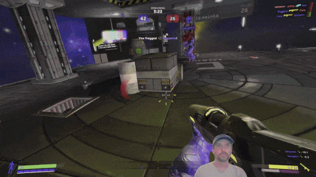

# Head tracking: the missing input for video games

**Move your head to look around. No VR headset or special hardware, just a webcam or phone.**

In most games, where you look is where you aim. Head tracking breaks that link: your head moves the view while your mouse or controller keeps aiming, so you can glance at a mirror or lean around a corner without your crosshair following.

Sim racers and flight simmers have played this way for decades, on the same monitor, controls and setup you already have.

**I think it deserves to be in every game.**

Hey, I'm Loop, and I'm trying to bust head tracking out of its niche.

I make easy-to-use head tracking software, and I mod open-source, OpenTrack-compatible head tracking into games that never shipped with it. <!-- BEGIN MOD COUNT -->90<!-- END MOD COUNT --> games so far.

Lopari, my launcher, finds your games and sets the mods up for you. Pick a supported game, press **Play with head tracking**, and go.

---

## Get playing in three steps

### 1. Install Lopari

**[Download Lopari](https://lopari.app)** for Windows 10 or 11. It's free, needs no account, has no ads, and sends no telemetry.

### 2. Install a tracker for your phone or webcam

- **Phone:** install **Headcam** from the [App Store](https://apps.apple.com/us/app/headcam/id6759300260) or [Google Play](https://play.google.com/store/apps/details?id=app.headcam.android).
- **Webcam:** install **[OpenTrack](https://github.com/opentrack/opentrack/releases)**.

The mods work with any OpenTrack compatible tracker. If you already have an OpenTrack setup, you can just use that.

### 3. Press play

Lopari finds the supported games on your PC. Pick one and press **Play with head tracking**. If a mod is needed, it's installed automatically and the game launches with head tracking enabled.

Want it back how it came? Choose **Remove** or **Play vanilla**.

Not sure your tracker is working? Hit **Test tracking** in Lopari before you launch.

---

## Supported games

- **Released** mods are well tested. Lopari installs them in one click.
- **Beta** mods are feature complete but less tested, and some may have known issues. Install them manually from GitHub, or through Lopari if you're a Patreon backer.

Outer Wilds is the one exception: its mod installs through the [Outer Wilds Mod Manager](https://outerwildsmods.com/mods/headtracking/).

Lopari also lists games that have head tracking built in, with no mod needed.

### New this week

<!-- BEGIN NEW ADDITIONS (generated by lopari.app: pixi run update-metadata) -->

- **No Man's Sky** (Released), added 2026-09-22 · [GitHub](https://github.com/itsloopyo/no-mans-sky-headtracking)
- **Subliminal** (Released), added 2026-09-20 · [GitHub](https://github.com/itsloopyo/subliminal-headtracking)
- **Dying Light** (Released), added 2026-09-19 · [GitHub](https://github.com/itsloopyo/dying-light-headtracking)
- **Ghostrunner** (Beta), added 2026-09-19 · [GitHub](https://github.com/itsloopyo/ghostrunner-headtracking)
- **Pathologic 2** (Beta), added 2026-09-19 · [GitHub](https://github.com/itsloopyo/pathologic-2-headtracking)
- **The Outer Worlds: Spacer's Choice Edition** (Released), added 2026-09-19 · [GitHub](https://github.com/itsloopyo/outer-worlds-spacers-choice-edition-headtracking)
- **Thief** (Beta), added 2026-09-19 · [GitHub](https://github.com/itsloopyo/thief-headtracking)
- **Black Mesa** (Released), added 2026-09-18 · [GitHub](https://github.com/itsloopyo/black-mesa-headtracking)
- **TT Isle of Man: Ride on the Edge 3** (Beta), added 2026-09-18 · [GitHub](https://github.com/itsloopyo/tt-isle-of-man-ride-on-the-edge-3-headtracking)
- **Far Cry 6** (Released), added 2026-09-17 · [GitHub](https://github.com/itsloopyo/far-cry-6-headtracking)
- **Indiana Jones and the Great Circle** (Beta), added 2026-09-17 · [GitHub](https://github.com/itsloopyo/indiana-jones-and-the-great-circle-headtracking)
- **Trepang2** (Released), added 2026-09-17 · [GitHub](https://github.com/itsloopyo/trepang2-headtracking)
- **Dishonored 2** (Beta), added 2026-09-16 · [GitHub](https://github.com/itsloopyo/dishonored-2-headtracking)
- **Outlast** (Beta), added 2026-09-16 · [GitHub](https://github.com/itsloopyo/outlast-headtracking)
- **RoadCraft** (Released), added 2026-09-16 · [GitHub](https://github.com/itsloopyo/roadcraft-headtracking)
- **Stormworks: Build and Rescue** (Beta), added 2026-09-16 · [GitHub](https://github.com/itsloopyo/stormworks-headtracking)

<!-- END NEW ADDITIONS -->

To hear about new mods as they land, add [lopari.app/feed.xml](https://lopari.app/feed.xml) to your feed reader.

### All mods

<!-- BEGIN MOD TABLE (generated by lopari.app: pixi run update-metadata) -->

| Game | Status | Supported stores | Links | Latest release |
|---|---|---|---|---|
| ABZÛ | Beta | Steam | [GitHub](https://github.com/itsloopyo/abzu-headtracking) | dev build (2026-08-20) |
| Alien: Isolation | Beta | Steam | [GitHub](https://github.com/itsloopyo/alien-isolation-headtracking) | dev build (2026-08-20) |
| Amnesia: The Dark Descent | Beta | Steam | [GitHub](https://github.com/itsloopyo/amnesia-the-dark-descent-headtracking) | dev build (2026-09-05) |
| Arx Fatalis | Beta | Steam, Xbox | [GitHub](https://github.com/itsloopyo/arx-fatalis-headtracking) | dev build (2026-09-10) |
| Assassin's Creed Unity | Beta | Ubisoft Connect | [GitHub](https://github.com/itsloopyo/assassins-creed-unity-headtracking) | dev build (2026-08-20) |
| Assetto Corsa EVO | Released | Steam | [GitHub](https://github.com/itsloopyo/assetto-corsa-evo-headtracking) · [Overtake.gg](https://www.overtake.gg/downloads/assetto-corsa-evo-head-tracking.86062/) | v1.1.3 (2026-09-09) |
| Assetto Corsa Rally | Released | Steam | [GitHub](https://github.com/itsloopyo/assetto-corsa-rally-headtracking) · [Overtake.gg](https://www.overtake.gg/downloads/assetto-corsa-rally-head-tracking.86201/) | v1.1.0 (2026-08-20) |
| BioShock Infinite | Beta | Steam | [GitHub](https://github.com/itsloopyo/bioshock-infinite-headtracking) | dev build (2026-09-16) |
| BioShock Remastered | Released | Steam | [GitHub](https://github.com/itsloopyo/bioshock-remastered-headtracking) · [NexusMods](https://www.nexusmods.com/bioshock/mods/144) | v0.5.0 (2026-09-17) |
| Black & White | Released | Retail | [GitHub](https://github.com/itsloopyo/black-and-white-headtracking) · [NexusMods](https://www.nexusmods.com/blackandwhite/mods/26) | v0.2.1 (2026-09-16) |
| Black Mesa | Released | Steam | [GitHub](https://github.com/itsloopyo/black-mesa-headtracking) | v0.1.1 (2026-09-18) |
| Blue Prince | Beta | Xbox | [GitHub](https://github.com/itsloopyo/blue-prince-headtracking) | dev build (2026-09-10) |
| Control: Ultimate Edition | Beta | Steam | [GitHub](https://github.com/itsloopyo/control-ultimate-edition-headtracking) | dev build (2026-08-20) |
| Cyberpunk 2077 | Released | GOG | [GitHub](https://github.com/itsloopyo/cyberpunk-2077-headtracking) · [NexusMods](https://www.nexusmods.com/cyberpunk2077/mods/32865) | v1.3.3 (2026-08-28) |
| Deus Ex: Human Revolution - Director's Cut | Beta | Steam | [GitHub](https://github.com/itsloopyo/deus-ex-human-revolution-headtracking) | dev build (2026-09-05) |
| Dishonored | Beta | Steam | [GitHub](https://github.com/itsloopyo/dishonored-headtracking) | dev build (2026-09-05) |
| Dishonored 2 | Beta | Steam | [GitHub](https://github.com/itsloopyo/dishonored-2-headtracking) | dev build (2026-09-16) |
| Dying Light | Released | Steam | [GitHub](https://github.com/itsloopyo/dying-light-headtracking) | v0.1.0 (2026-09-19) |
| Dying Light 2 Stay Human | Released | Steam | [GitHub](https://github.com/itsloopyo/dying-light-2-headtracking) · [NexusMods](https://www.nexusmods.com/dyinglight2/mods/1900) | v1.4.0 (2026-08-20) |
| Easy Delivery Co | Released | Xbox | [GitHub](https://github.com/itsloopyo/easy-delivery-co-headtracking) · [NexusMods](https://www.nexusmods.com/easydeliveryco/mods/18) | v0.2.0 (2026-08-20) |
| Eternal Afternoon | Released | Steam | [GitHub](https://github.com/itsloopyo/eternal-afternoon-headtracking) | v0.2.0 (2026-08-20) |
| Fallout 4 | Beta | Steam, GOG, Xbox | [GitHub](https://github.com/itsloopyo/fallout-4-headtracking) | dev build (2026-09-09) |
| Fallout: New Vegas | Released | Steam, Xbox | [GitHub](https://github.com/itsloopyo/fallout-new-vegas-headtracking) | v0.3.1 (2026-09-16) |
| Far Cry 6 | Released | Steam, Ubisoft Connect | [GitHub](https://github.com/itsloopyo/far-cry-6-headtracking) | v0.1.0 (2026-09-20) |
| Firewatch | Released | Xbox | [GitHub](https://github.com/itsloopyo/firewatch-headtracking) | v0.4.0 (2026-08-20) |
| Ghostrunner | Beta | Steam | [GitHub](https://github.com/itsloopyo/ghostrunner-headtracking) | dev build (2026-09-19) |
| Gone Home | Released | Steam | [GitHub](https://github.com/itsloopyo/gone-home-headtracking) | v1.5.0 (2026-08-20) |
| Green Hell | Released | Steam | [GitHub](https://github.com/itsloopyo/green-hell-headtracking) · [NexusMods](https://www.nexusmods.com/greenhell/mods/83) | v1.3.0 (2026-08-20) |
| Half-Life 2 | Released | Steam | [GitHub](https://github.com/itsloopyo/half-life-2-headtracking) | v0.2.0 (2026-09-13) |
| High On Life | Beta | Steam, Xbox | [GitHub](https://github.com/itsloopyo/high-on-life-headtracking) | dev build (2026-09-09) |
| Indiana Jones and the Great Circle | Beta | Xbox, Microsoft Store | [GitHub](https://github.com/itsloopyo/indiana-jones-and-the-great-circle-headtracking) | dev build (2026-09-17) |
| Kingdom Come: Deliverance | Beta | Steam, Xbox | [GitHub](https://github.com/itsloopyo/kingdom-come-deliverance-headtracking) | dev build (2026-09-09) |
| Kingdom Come: Deliverance II | Beta | Steam, Xbox | [GitHub](https://github.com/itsloopyo/kingdom-come-deliverance-2-headtracking) | dev build (2026-09-10) |
| Metaphor: ReFantazio | Beta | Steam | [GitHub](https://github.com/itsloopyo/metaphor-refantazio-headtracking) | dev build (2026-08-20) |
| Metro Exodus Enhanced Edition | Beta | Steam | [GitHub](https://github.com/itsloopyo/metro-exodus-enhanced-edition-headtracking) | dev build (2026-09-05) |
| Minecraft: Bedrock Edition | Released | Microsoft Store | [GitHub](https://github.com/itsloopyo/minecraft-bedrock-edition-headtracking) | v1.1.2 (2026-08-29) |
| Mirror's Edge | Beta | Steam | [GitHub](https://github.com/itsloopyo/mirrors-edge-headtracking) | dev build (2026-09-10) |
| No Man's Sky | Released | Steam, Xbox | [GitHub](https://github.com/itsloopyo/no-mans-sky-headtracking) | v0.1.0 (2026-09-22) |
| Outer Wilds | Released | Steam | [GitHub](https://github.com/itsloopyo/outer-wilds-headtracking) · [OWMM](https://outerwildsmods.com/mods/headtracking/) | v1.3.0 (2026-08-20) |
| Outlast | Beta | Steam | [GitHub](https://github.com/itsloopyo/outlast-headtracking) | dev build (2026-09-16) |
| Pacific Drive | Beta | Steam, Xbox | [GitHub](https://github.com/itsloopyo/pacific-drive-headtracking) | dev build (2026-09-11) |
| Pathologic 2 | Beta | Steam | [GitHub](https://github.com/itsloopyo/pathologic-2-headtracking) | dev build (2026-09-19) |
| PEAK | Released | Steam | [GitHub](https://github.com/itsloopyo/peak-headtracking) · [NexusMods](https://www.nexusmods.com/peak/mods/167) | v1.3.0 (2026-08-20) |
| Pinball FX | Beta | Steam | [GitHub](https://github.com/itsloopyo/pinball-fx-headtracking) | dev build (2026-08-25) |
| Portal | Beta | Steam | [GitHub](https://github.com/itsloopyo/portal-headtracking) | dev build (2026-09-11) |
| Portal 2 | Beta | Steam | [GitHub](https://github.com/itsloopyo/portal-2-headtracking) | dev build (2026-08-20) |
| Portal with RTX | Released | Steam | [GitHub](https://github.com/itsloopyo/portal-with-rtx-headtracking) | v0.1.0 (2026-09-05) |
| Prey | Beta | Steam, Xbox | [GitHub](https://github.com/itsloopyo/prey-headtracking) | dev build (2026-09-11) |
| Quake II RTX | Beta | Steam | [GitHub](https://github.com/itsloopyo/quake-ii-rtx-headtracking) | dev build (2026-09-10) |
| R.E.P.O. | Beta | Steam | [GitHub](https://github.com/itsloopyo/repo-headtracking) | dev build (2026-08-20) |
| Red Eclipse | Released | Steam | [GitHub](https://github.com/itsloopyo/red-eclipse-headtracking) | v0.3.1 (2026-09-13) |
| Resident Evil 2 | Beta | Steam | [GitHub](https://github.com/itsloopyo/resident-evil-2-headtracking) | dev build (2026-08-20) |
| Resident Evil 3 | Beta | Steam | [GitHub](https://github.com/itsloopyo/resident-evil-3-headtracking) | dev build (2026-08-20) |
| Resident Evil 4 | Beta | Steam | [GitHub](https://github.com/itsloopyo/resident-evil-4-headtracking) | dev build (2026-08-20) |
| Resident Evil 7 biohazard | Beta | Steam | [GitHub](https://github.com/itsloopyo/resident-evil-7-headtracking) | dev build (2026-08-20) |
| Resident Evil Requiem | Released | Steam | [GitHub](https://github.com/itsloopyo/resident-evil-requiem-headtracking) · [NexusMods](https://www.nexusmods.com/residentevilrequiem/mods/1678) | v0.4.0 (2026-08-25) |
| Resident Evil Village | Beta | Steam | [GitHub](https://github.com/itsloopyo/resident-evil-village-headtracking) | dev build (2026-08-20) |
| Return of the Obra Dinn | Released | Steam | [GitHub](https://github.com/itsloopyo/obra-dinn-headtracking) · [NexusMods](https://www.nexusmods.com/returnoftheobradinn/mods/9) | v1.3.0 (2026-08-20) |
| RoadCraft | Released | Steam | [GitHub](https://github.com/itsloopyo/roadcraft-headtracking) | v0.1.0 (2026-09-16) |
| RV There Yet? | Released | Steam, Xbox | [GitHub](https://github.com/itsloopyo/rv-there-yet-headtracking) | v0.3.0 (2026-08-20) |
| Shadows of Doubt | Beta | Steam | [GitHub](https://github.com/itsloopyo/shadows-of-doubt-headtracking) | dev build (2026-08-26) |
| Skyrim Special Edition | Released | Steam | [GitHub](https://github.com/itsloopyo/skyrim-special-edition-headtracking) · [NexusMods](https://www.nexusmods.com/skyrimspecialedition/mods/180328) | v0.3.0 (2026-08-20) |
| SnowRunner | Released | Steam, Xbox | [GitHub](https://github.com/itsloopyo/snowrunner-headtracking) | v0.2.0 (2026-09-11) |
| SOMA | Beta | Steam | [GitHub](https://github.com/itsloopyo/soma-headtracking) | dev build (2026-09-10) |
| Sons of the Forest | Beta | Steam | [GitHub](https://github.com/itsloopyo/sons-of-the-forest-headtracking) | dev build (2026-08-20) |
| Spec Ops: The Line | Beta | Steam | [GitHub](https://github.com/itsloopyo/spec-ops-the-line-headtracking) | dev build (2026-09-05) |
| Starfield | Beta | Steam, Xbox | [GitHub](https://github.com/itsloopyo/starfield-headtracking) | dev build (2026-09-14) |
| Still Wakes the Deep | Released | Steam | [GitHub](https://github.com/itsloopyo/still-wakes-the-deep-headtracking) | v0.2.0 (2026-08-30) |
| Stormworks: Build and Rescue | Beta | Steam | [GitHub](https://github.com/itsloopyo/stormworks-headtracking) | dev build (2026-09-16) |
| Subliminal | Released | Steam | [GitHub](https://github.com/itsloopyo/subliminal-headtracking) | v0.1.0 (2026-09-20) |
| Subnautica | Released | Steam | [GitHub](https://github.com/itsloopyo/subnautica-headtracking) · [NexusMods](https://www.nexusmods.com/subnautica/mods/3169) | v1.4.0 (2026-08-20) |
| Subnautica 2 | Released | Steam, Xbox | [GitHub](https://github.com/itsloopyo/subnautica-2-headtracking) · [NexusMods](https://www.nexusmods.com/subnautica2/mods/250) | v0.6.2 (2026-09-08) |
| Superliminal | Released | Steam, Xbox | [GitHub](https://github.com/itsloopyo/superliminal-headtracking) | v0.2.0 (2026-09-13) |
| The Outer Worlds: Spacer's Choice Edition | Released | Steam | [GitHub](https://github.com/itsloopyo/outer-worlds-spacers-choice-edition-headtracking) | v0.1.0 (2026-09-19) |
| The Painscreek Killings | Beta | Steam | [GitHub](https://github.com/itsloopyo/the-painscreek-killings-headtracking) | dev build (2026-08-20) |
| The Vanishing of Ethan Carter Redux | Beta | Steam | [GitHub](https://github.com/itsloopyo/the-vanishing-of-ethan-carter-redux-headtracking) | dev build (2026-09-11) |
| The Witness | Beta | Steam | [GitHub](https://github.com/itsloopyo/the-witness-headtracking) | dev build (2026-09-16) |
| Thief | Beta | Steam | [GitHub](https://github.com/itsloopyo/thief-headtracking) | dev build (2026-09-19) |
| Titanfall 2 | Beta | Steam | [GitHub](https://github.com/itsloopyo/titanfall-2-headtracking) · [NexusMods](https://www.nexusmods.com/titanfall2/mods/74) | dev build (2026-08-30) |
| Trepang2 | Released | Steam, GOG, Xbox | [GitHub](https://github.com/itsloopyo/trepang2-headtracking) | v0.2.0 (2026-09-18) |
| TT Isle of Man: Ride on the Edge 3 | Beta | Steam | [GitHub](https://github.com/itsloopyo/tt-isle-of-man-ride-on-the-edge-3-headtracking) | dev build (2026-09-18) |
| Valheim | Released | Steam | [GitHub](https://github.com/itsloopyo/valheim-headtracking) · [NexusMods](https://www.nexusmods.com/valheim/mods/3356) | v0.3.0 (2026-08-20) |
| Viewfinder | Beta | Steam | [GitHub](https://github.com/itsloopyo/viewfinder-headtracking) | dev build (2026-09-15) |
| What Remains of Edith Finch | Released | Steam | [GitHub](https://github.com/itsloopyo/what-remains-of-edith-finch-headtracking) | v1.1.1 (2026-09-03) |
| Wobbly Life | Beta | Steam, Xbox | [GitHub](https://github.com/itsloopyo/wobbly-life-headtracking) | dev build (2026-09-11) |
| Wolfenstein: The New Order | Beta | Steam, Xbox | [GitHub](https://github.com/itsloopyo/wolfenstein-the-new-order-headtracking) | dev build (2026-09-13) |
| Wreckfest | Released | Steam, Xbox | [GitHub](https://github.com/itsloopyo/wreckfest-headtracking) | v0.1.0 (2026-09-03) |
| Wreckfest 2 | Released | Steam | [GitHub](https://github.com/itsloopyo/wreckfest-2-headtracking) | v0.1.0 (2026-09-05) |
| Yakuza 0 | Beta | Steam | [GitHub](https://github.com/itsloopyo/yakuza-0-headtracking) | dev build (2026-08-20) |
| YAPYAP | Released | Steam | [GitHub](https://github.com/itsloopyo/yapyap-headtracking) | v0.2.0 (2026-08-20) |

<!-- END MOD TABLE -->

Every mod is free and open source under the MIT licence.

---

## Support

Everything here is free, and every mod is open source.

If you'd like to support the work, [Patreon](https://www.patreon.com/itsloopyo) backers help fund new mods, fixes and whatever I build next. Backers also get one-click install and updates for Beta mods in [Lopari](https://lopari.app), plus access to [Lab](https://lab.decoupled.cam) and other tooling I build.

Want to suggest a game, report a bug, or just hang out? Join the [Discord](https://discord.gg/dxyZdyFNT9).
